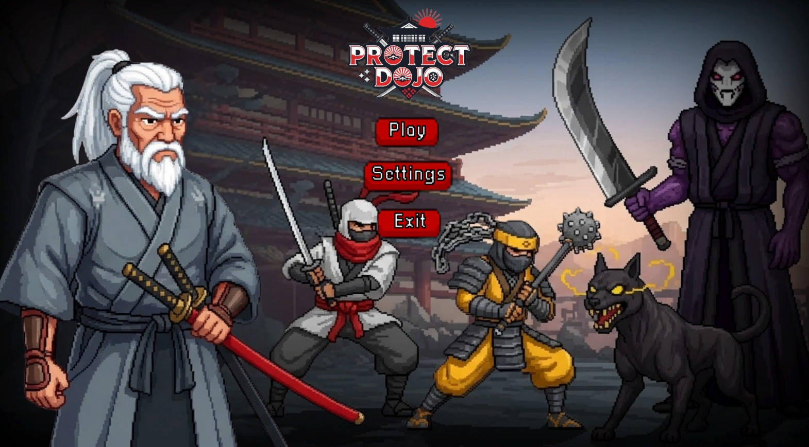
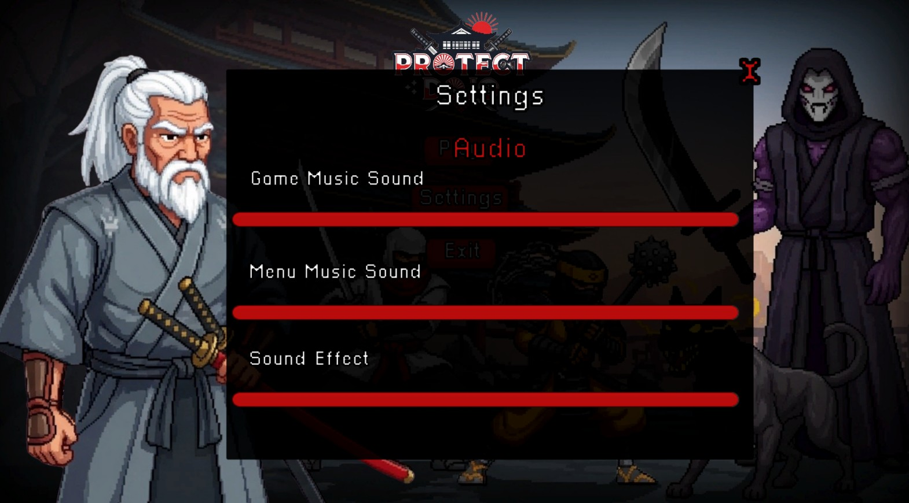
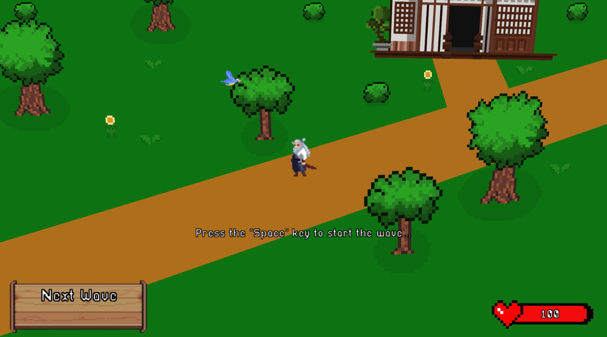
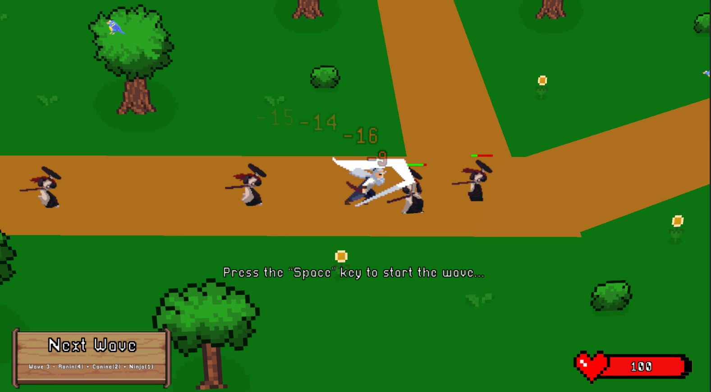
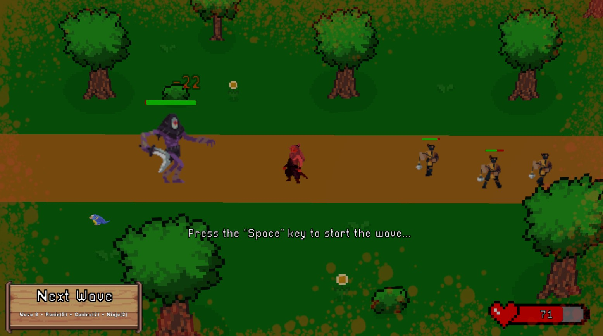
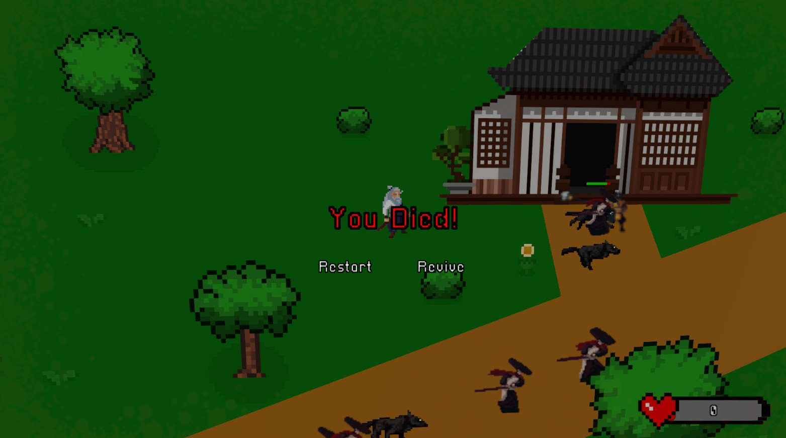

# 🎮 Case Project – Samurai Defense Prototipi  

Bu proje, **KFA Entertainment** için hazırlanmış bir **case study** çalışmasıdır.  
Amaç, Unity kullanılarak temel bir **wave-based defense** oyun döngüsünün oynanabilir bir prototipini sunmaktır.  

Oyun, **3D bir ortamda 2D sprite’ların (billboard tekniğiyle)** kullanıldığı bir yapıda tasarlanmıştır.  
**Ek olarak assetler placeholder değildir, oyunun hikayesi ile uyumludur ve hazır assetlerdir.**  

---

## 📖 Hikaye – *Dojonun Son Ustası*  

Uzak dağların gölgesinde, efsanevi bir samurai dojosu yüzyıllar boyunca savaşçılara disiplin ve onur öğretti.  
Ama artık dojo eski ihtişamından uzak; çoğu öğrenci dağılmış ya da düşmana yenik düşmüş durumda.  

Şimdi, geriye sadece yaşlı bir **samurai ustası** kaldı.  
Ömrünün son demlerinde olsa da, onuru ve dojo’suna olan sadakati her şeyden güçlü.  

Onun görevi: **dojosunu sonsuz dalgalarla gelen düşmanlardan korumak.**  
Ne kadar uzun süre dayanırsa, ustanın mirası ve samurai onuru o kadar büyüyecek.  

---

## 📸 Ekran Görüntüleri  

> Örnek ekran görüntüleri, playtest sürecinden alınmıştır.  

  
  
  
  
  
  

---

## 🕹️ Oynanış  

- **Oyuncu (Samurai)**
  - WASD ile hareket.  
  - **Yakın mesafe saldırıları** yapabilir.  
  - **Cooldown** sistemi ile dengelenmiş saldırılar.  
  - Hasar aldığında kısa süreli **I-Frame** (yaralanmazlık).  

- **Düşman Tipleri**  
  - **Ninja** 🥷: Yavaş hareket eder, **yüksek hasar** verir.  
  - **Canine** 🐺: Çok hızlıdır, **orta hasar** verir.  
  - **Ronin** ⚔️: Normal hızda, **normal hasar** verir.  
  - **Boss** 👹: Ağır yürür, dojoya **%75 büyük hasar** verir.
 
 - **Navigasyon Sistemi**
    - Eğer sahnede düşman varsa ve kamera kadrajında görünmüyorsa,  
      ekranın üst-ortasında **geliş yönünü gösteren bir gösterge** belirir.  
    - Oyuncuya düşmanların nereden geleceğini anlaması için yardımcı olur.

- **Oyun Döngüsü**  
  - Düşmanlar oyuncuya değil, **dojoya zarar verir**.  
  - Oyuncu, dalgalar halinde gelen düşmanlara karşı dojosunu savunur.  
  - **Space tuşu** ile ilk dalga başlatılır, tekrar basıldığında bir sonraki dalgalar gelir.  
  - Sonsuz ve modüler şekilde tasarlanmış wave sistemi.  

- **Müzik & Ses Sistemi**  
  - Eğer sahnede **hiç düşman yoksa** → rastgele bir **idle müzik** çalar.  
  - Eğer sahnede **düşman varsa** → rastgele bir **battle müzik** çalar.  
  - Menüde, **ayarlar ekranından** menü müziği, oyun müziği ve ses efektleri ayrı ayrı ayarlanabilir.  
  - Kuş cıvıltıları ve rüzgar ses efektleri ile atmosfer desteklenmiştir.  

- **Çevresel Atmosfer**  
  - Sahneye uyumlu **pixel art kuşlar** bulunur ve hareket eder.  
  - Ağaçlar ve çevre, hafif rüzgar esiyormuş gibi sallanır.  
  - Görsel olarak daha canlı bir oyun dünyası sunar.  

---

## ⚙️ Varsayımlar  

- Düşmanlar doğrudan oyuncuya saldırmaz, yalnızca dojoya zarar verir.  
- Assetler placeholder değildir, hikaye ile uyumludur.  
- Temel amaç, **mekaniklerin çalışır ve test edilebilir** olmasıdır.  

---

## 🛠️ Kullanılan Teknolojiler  

- **Oyun Motoru:** Unity 6.0 (URP)  
- **Animasyon & Tweening:** DOTween  
- **Dil:** C#  

---
